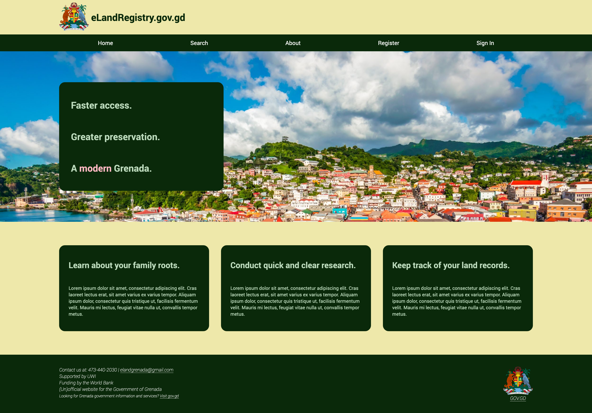
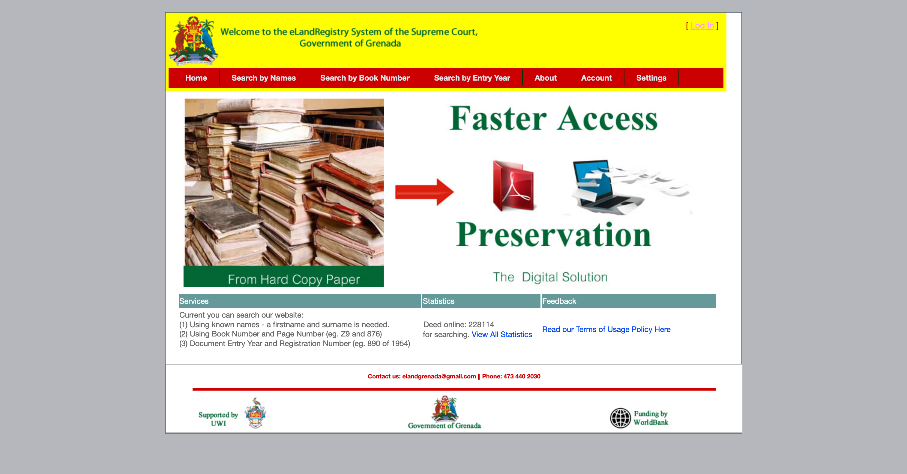

The goal of this project is to experiment with redesigning the eLandRegistry System website of Grenada, utilizing the national flag color palette as well as the original website's color scheme. Users will be able to search/filter for (dummy) records of properties. 

As a stretch goal, I'd like to implement a backend so that users can create real accounts to "log in" - but this functionality wouldn't affect anything on the website itself.

EDIT: STRETCH GOAL MET!
Full stack site: https://gd-project.onrender.com/
The static site is faster to load (currently using the free tier on Render for the full-stack version), but you can log in with the credentials:
username: sarah1
password: abc123
This allows you to search the land records on the search page.

My [updated version](https://nicholasboyce.github.io/gd-project/) looks like this:

The original [website](https://elandregistry.gov.gd/) looks like this:

Stories:
- [X] Implement responsive navbar
- [X] Create separate search page
- [X] Create separate about page
- [X] Create login pop up
- [X] Create register page
- [X] Implement backend
- [X] Allow users to see all available data
- [X] Allow users to search data through book number
- [X] Allow users to search data via document registration number
- [X] Allow users to search data through document entry year
- [X] Allow users to search data via known names (first and last)

Technologies Involved:
- HTML
- CSS
- Javascript
- JS Fetch API
- IndexedDB API
- Cache API (Offline storage/website usability)
- Java
- Spring Boot
- H2 / SQL
